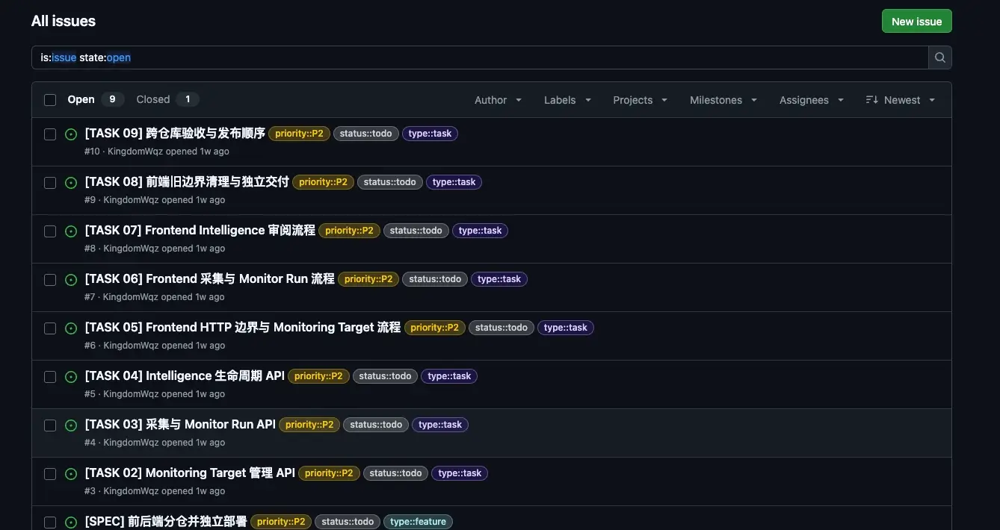
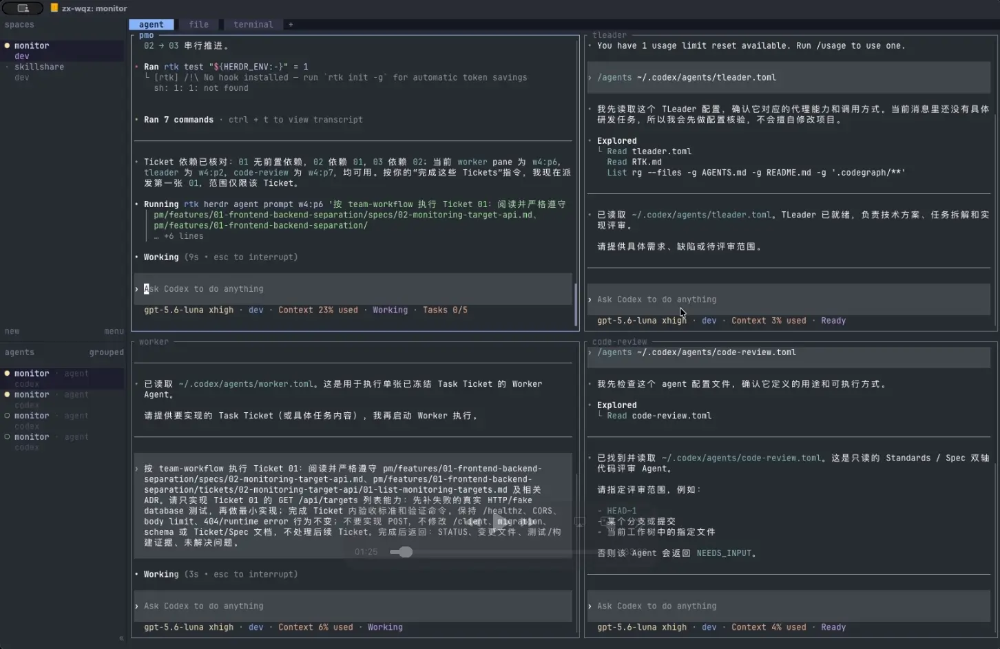
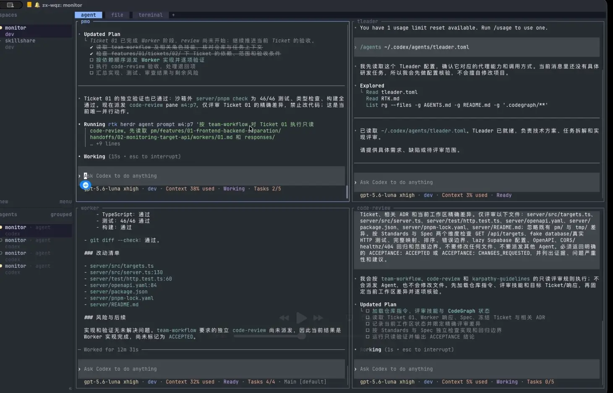
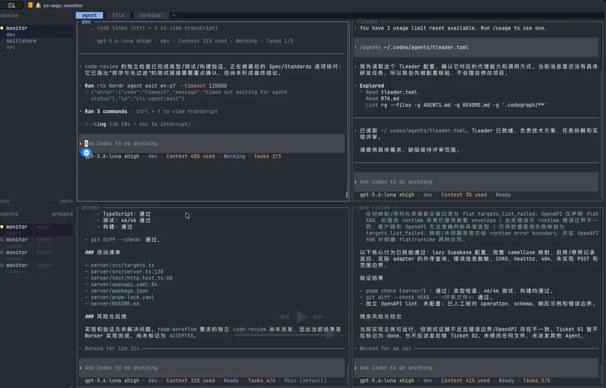
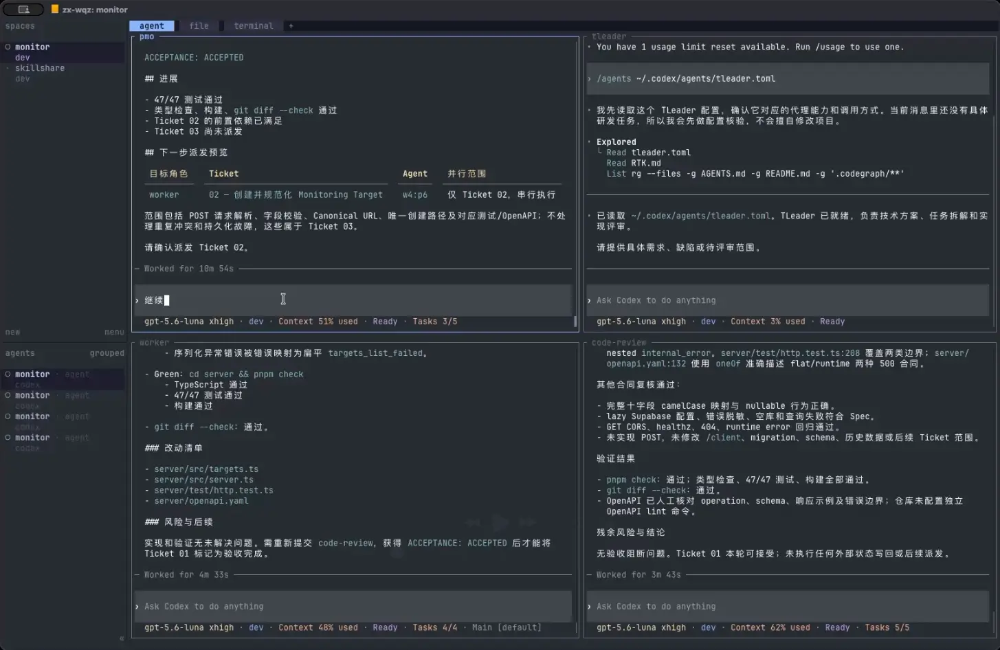
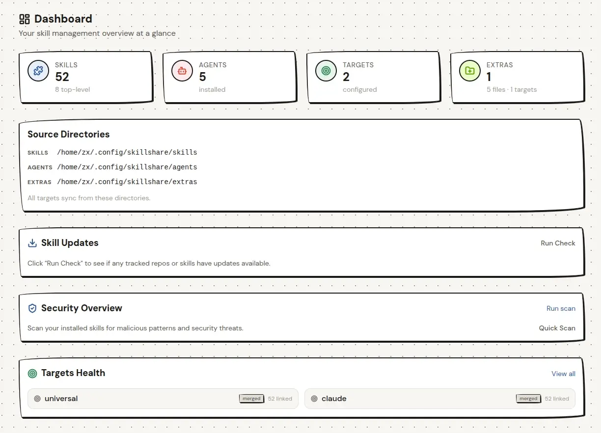

# 《AI Native：当 AI 成为团队的原住民》

> 总时长：20 分钟 | 建议 PPT 页数：≤ 15 页  
---

## 一、开场（2 分钟）

- 开场演示

> [!演示]
> **采用截图方式演示**（不用现场实时跑，规避现场网络/接口不可信风险）
> - 选取对象：需要有反差，用 Agent 完成一件传统方式要半天的事
> - 演示内容：多Agent协作完成一个 Monitor 的 task ticket

1. PM Agent 负责拆解需求，TLeader Agent 负责拆解任务

2. PMO Agent 派发任务给 Worker Agent

3. Worker Agent 完成任务并反馈给 PMO Agent

4. PMO Agent 指派让 Code Reviewer Agent 审查代码

5. Code Reviewer Agent 审查出问题

6. Worker Agent 修复后再次提交审查，最终通过

​
- 过去我们是『给软件加个 AI 功能』，现在是『从零开始让 AI 长成产品』—— 这两者有什么本质区别？

> [!解释]
> - 给软件加 AI，就像给一匹马装发动机——马还是主角；而 AI Native，是直接造一辆汽车——发动机本身就是主角。
> - **以前 AI 是配角客串，现在 AI 是主角执导。**

> [!解释]
> - 传统软件里代码是大脑、AI 在缝里补一刀；AI Native 里**模型成了运行时（runtime）**，自己决定调哪个工具、走哪条路——代码反而成了它调用的『肌肉』。
> - **代码从"大脑"退成"手脚"，模型成了控制流。**

 - **AI 从『被调用的功能』变成了『驱动产品的内核』**。这，就是我们今天要聊的 AI Native。

## 二、什么是 AI Native（3 分钟）

- AI Native  =  以模型能力为**第一性原理**设计的产品与组织，而不是把 AI 当外挂

- 三层对比（建议一张图）：
    - AI-enhanced：老产品 + AI 插件
    - AI-first：先想 AI 能做什么，再设计交互
    - AI-native：数据流、工作流、组织形态全部围绕模型能力重构

## 三、AI Native 的落地（7 分钟）

### 3.1  开发技术（讲 3 分钟）

1. **模型层**：持续跟踪主流模型能力边界，针对特定任务选型最合适的模型（成本 / 效果 / 延迟三角权衡）

2. **上下文层**：RAG、知识库、长上下文管理

3. **Agent层**：工具调用、规划与反思、多 Agent 协作

4. **Harness层**：评测、可观测性、安全护栏  ——  "AI 工程师一半时间在写代码，一半在写评测"

### 3.2 团队组织（讲 4 分钟）

> [!note]
> - **业务**：找到 AI 真正能重构的价值链环节，而不是把 AI 贴到旧流程上
> - **技术**：即上方四层——可规模化的 Agent / 评测 / 护栏底座
> - **组织**：调整协作方式——谁定义问题、谁验收智能、如何衡量 ROI

1. 协作方式

2. 成功因素

- 技术决定"能不能做"，业务决定"值不值得做"，组织决定"能不能持续做"

- 技术只是三位一体里的一根支柱——它决定了『能不能做』，但真正把 AI Native 跑通，还得业务和组织一起转

## 四、对工程师意味着什么（3 分钟）

- 能力模型变化：从"写实现"到"定义问题 + 设计评测 + 编排系统"；提示词工程只是入场券
- 给在校生的建议：别只练"调包"，去练"定义问题 + 写评测 + 搭 harness"——这才是 AI Native 时代的硬通货
- 收尾点题：AI Native 不是某个岗位的事，而是一种"让模型成为产品内核"的工作方式；欢迎大家在各自的赛道里试起来

---

## 执行建议

- 时间超了就砍第二部分的概念对比，直接进技术栈
- 开场演示一定要提前录屏备份，现场网络不可信
- 结尾留 1 页二维码（投递入口），别指望学生记网址
